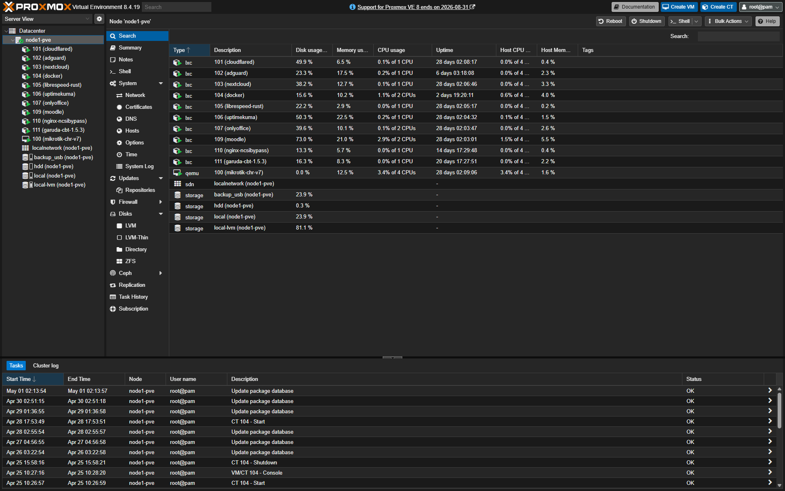

# Architecting a High-Availability Private Cloud for Campus Ecosystem

## 1. Executive Summary
Designed, deployed, and currently managing a robust private cloud infrastructure using Proxmox VE. This environment serves as the digital backbone for a high-traffic educational institution, handling seamless Computer-Based Tests (CBT) for 400+ concurrent users, private cloud storage, and secure network routing.

## 2. The Architecture & Tech Stack

Based on the environment topology above, the infrastructure is segregated into optimized LXC containers and QEMU VMs to maximize bare-metal resources:

*   **Hypervisor:** Proxmox VE 8.x
*   **Core Routing (QEMU VM):** MikroTik CHR v7 serving as the main network gateway, handling VLANs and load balancing.
*   **Observability & Monitoring (LXC):** `uptimekuma` for real-time tracking of service health and network latency.
*   **Zero Trust & Security (LXC):** `cloudflared` for secure external tunneling and `adguard` for network-wide DNS filtering and ad-blocking.
*   **Web Server & Production Apps (LXC):** 
    *   `moodle` & `garuda-cbt`: High-concurrency examination platforms.
    *   `nextcloud` & `onlyoffice`: Self-hosted, on-premise document collaboration suite.
*   **Network Hacks & Optimization:** `nginx-ncsibypass` engineered specifically to spoof Microsoft's Network Connectivity Status Indicator.

## 3. Key Engineering Highlights
*   **Resource Efficiency:** Heavily utilized LXC (Linux Containers) over heavy VMs for application deployments, resulting in extremely low CPU usage and minimal RAM footprint.
*   **Network Segregation:** Kept the network logically separated by putting the core router (MikroTik CHR) inside the hypervisor, creating a true "Router on a Stick" environment within Proxmox.
